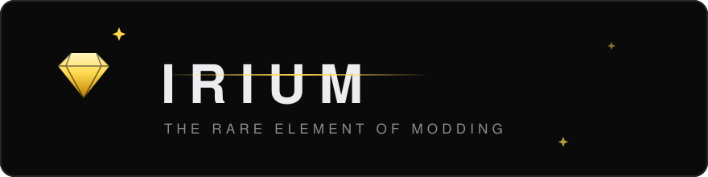
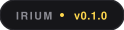
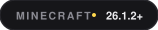
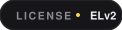
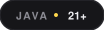

<div align="center">
  <a href="https://github.com/Lyecocoworld/irium">
    
  </a>

  <br/>

  <p>
    <a href="#status"></a>
    <a href="plugin/pom.xml"></a>
    <a href="#compatibility"></a>
    <a href="LICENSE"></a>
    <a href="#technology"></a>
  </p>

  <p><strong>The server handles both sides.<br/>Mods are streamed, not installed.</strong></p>
</div>

---

## The problem

Playing on a modded server today means installing a loader, an API, and every mod by hand — for each server, each pack, each update. Most players never do it. So plugin servers can't offer what modded servers offer, and the two worlds stay separate.

## What Irium is

Two parts:

- **A server plugin.** Install it like any Paper plugin. It adds a `mods/` folder to your server directory, next to `world/` and `plugins/`. Drop mods into it — that's the whole setup. Irium loads them and streams what clients need.
- **A client agent.** A small JVM agent (~300 KB) installed once, via a one-click app. It works with any launcher and any instance. After that, every Irium server works automatically.

Mods keep the usual loader rules: Irium-native mods first, Fabric / Forge / NeoForge support later through a gateway — one loader at a time, no cross-loading.

## How it works

**Player side.** Join an Irium server and you get a simple prompt, like the resource pack prompt: *do you want the full version?* Accept, and modules load into your session — interfaces, HUD, rendering, gameplay. Decline, and you play the baseline. On disconnect, everything the server added disappears; the client is vanilla again.

**Server side.** To stream mods, a server must be enrolled with the Irium platform and hold a valid authentication key. An unenrolled server or an invalid key gets nothing — the agent rejects it. Every module is signed and verified before it runs.

**Why authentication exists.** Irium streams real code into players' JVMs — that power must never be anonymous. Without a trust chain, any server could push disguised malware into players' machines: steal data, damage files, mine crypto. Enrollment is what makes the ecosystem safe: trusted servers stream, untrusted ones get nothing. It is also what keeps the platform compliant with Mojang's usage rules. The goal is a technology that is 100% safe for players.

```text
        vanilla client
              │
              ▼
    irium agent · ~300 KB · installed once
              │   enrollment · signed manifest · verified
              ▼
    irium server ─── runtime ─ mods ─ api ─ content
              │
              ▼
    hud · interfaces · rendering · input · gameplay
    appears in the session · gone on disconnect
```

## Compatibility

| | |
|---|---|
| Server | Paper / Canvas / Folia — standard plugin |
| Client | any launcher, any instance · agent required for the full version |
| Mods | Irium-native via drag and drop · Fabric / Forge / NeoForge via gateway (planned, one loader at a time) |
| Without agent | the server plays as a normal plugin server |

## Status

In development — phase 0. Nothing is production-ready yet.

| Milestone | State |
|---|---|
| Server plugin: join prompt, session channel | done |
| Agent: live HUD injection (PoC) | next |
| Handshake, signed module streaming, session sandbox | planned |
| Native mod API + devkit | planned |
| Fabric / Forge / NeoForge gateway | last |

## Research

This project builds on five years of technical research: how far a vanilla client can be pushed before it needs modification. Full documents in [`docs/research/`](docs/research/):

| Document | Contents |
|---|---|
| [`REPORT_SDM`](docs/research/REPORT_SDM.md) | Escalation levels, classloaders, JVM agents, protocol, server architecture, security |
| [`REPORT_SDM2`](docs/research/REPORT_SDM2.md) | Injection rails, ghost versions, hot attach, distribution |
| [`VALIDATION_SDM`](docs/research/VALIDATION_SDM.md) | Lab falsification on JDK 25: premain, retransform, hot attach |
| [`CONCLUSION_AND_PLAN`](docs/research/CONCLUSION_AND_PLAN.md) | Findings, methodology, MVP roadmap |

## Technology

| | |
|---|---|
| Server | Paper or Folia plugin, Java 21 |
| Agent | JVM agent (startup + hot attach), ASM, Ed25519 |
| Security | enrolled servers, signed modules, revocation |


## License

Elastic License 2.0 — see [LICENSE](LICENSE).

Almost everything is open: the plugin, the Microsoft Store app (free), and the Irium API used to write Irium-safe mods or include mods potential into your plugins. You can read, modify, and redistribute all of it, including commercially.

One part is not open: the authentication component of the plugin. It ships as a closed binary, and the license forbids circumventing it. This includes creating or recreating an authentication system, or building any bypass of it — even by modifying the open code. Doing so is a direct violation of the license and of copyright law; the authentication is what protects players from malicious servers. Server enrollment is handled remotely by the platform — validation is free for test and small servers, paid for large ones (which include support and services).

In short: the code is free, the trust chain is protected.

Independent project, not affiliated with Mojang Studios or Microsoft. Minecraft is a trademark of Mojang Studios.
